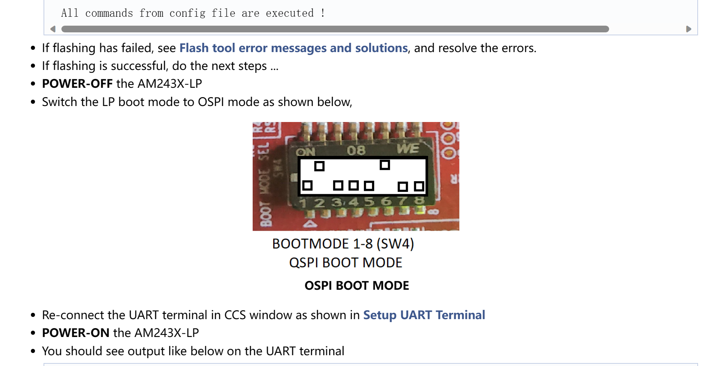

## 1. CUBE IDE Website （New User need registration）
https://www.st.com/en/development-tools/stm32cubeide.html#get-software
download and setup the IDE

## 2. TI CCS (Code Composer Studio)

### 2.1 SDK download
MCU_PLUS_SDK_AM243X User Guide
	https://dev.ti.com/tirex/explore/node?node=A__AD2nw6Uu4txAz2eqZdShBg__com.ti.MCU_PLUS_SDK_AM243X__AROnekL__LATEST
0. MCU-PLUS-SDK-AM243X
	https://www.ti.com.cn/tool/cn/download/MCU-PLUS-SDK-AM243X
	https://www.ti.com.cn/tool/cn/download/MCU-PLUS-SDK-AM243X/08.04.00.17
	https://www.ti.com/tool/download/MCU-PLUS-SDK-AM243X/09.00.00.35
1. SysConfig 1.17 C://ti
	https://software-dl.ti.com/ccs/esd/sysconfig/sysconfig-1.17.0_3128-setup.exe
2. python3
3. openssl-1.1.1 
	https://slproweb.com/products/Win32OpenSSL.html
4. dfu-util-0.8
	http://dfu-util.sourceforge.net/releases/dfu-util-0.8-binaries/win32-mingw32/dfu-util-static.exe
5. windows generic USB driver （zadig-2.7）
	https://github.com/pbatard/libwdi/releases/download/v1.4.1/zadig-2.7.exe


### 2.2 CCS download

1. CCS Download
	https://www.ti.com/tool/CCSTUDIO
2. CCS Installation Guide
	https://dev.ti.com/tirex/explore/content/mcu_plus_sdk_am243x_09_00_00_35/docs/api_guide_am243x/CCS_SETUP_PAGE.html
3. Set package paths
	CCS > Window > Preferences > Code Composer Studio > Products
	

### 2.3 Board Flash Boot Setup
1. set the board to be uart boot mode.


2. run the following script:
C:\ti\mcu_plus_sdk_am243x_09_00_00_35 is the location of installed sdk. (Earlier Version has bugs). COM4 is the corresponding serial port.
```
cd C:\ti\mcu_plus_sdk_am243x_09_00_00_35\tools\boot
python uart_uniflash.py -p COM4 --cfg=sbl_prebuilt/am243x-lp/default_sbl_null.cfg
```

3. Til now, the program can be run under OSPI boot mode.


### 2.4 Launch and Run
1. set target config and launch it. 
(in {soc name}_{JTAG type}.ccxml)
We use `XDS110 USB Debug Probe` and `AM243x_LAUNCHPAD`.

2. connect the deivce and <b>reset CPU</b>.

3. Load program and run!

4. serial port monitoring
baud rate: 115200
data size: 8-bits
parity: None
stop bits: 1
encoding: ISO-8859-1