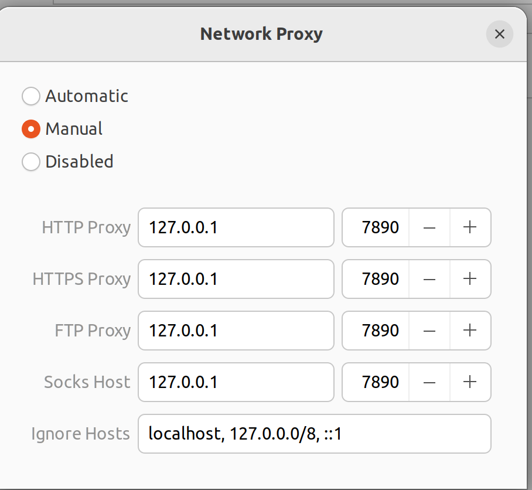

# VPN

## Windows

### clash for Windows
clash is a packet transceiver, routing packets from computer to remote VPN server.
https://clashforwindows.org/clash-for-windows-download/

### VPN setting
1. Enable proxy on Windows.


2. You buy a URL from some proxy server website (e.g., [mojie](https://mojie.me/)), and copy your URL.

3. Copy your URL into clash `Profiles`, and press download.

4. Try something like google scholar.


## Linux

### clash for Linux
Install corresponding version from the release.
https://github.com/doreamon-design/clash/releases
```
mv clash /usr/bin/
```

### VPN setting
copy the yaml file to linux machine.
https://doreamon-design.github.io/clash/configuration/getting-started.html
```
clash -f /path/to/yaml
```

## USE PROXY in terminal
```bash
# linux
export HTTP_PROXY=http://127.0.0.1:7890
export HTTPS_PROXY=http://127.0.0.1:7890
```

```bat
# windows
set HTTP_PROXY=http://127.0.0.1:7890
set HTTPS_PROXY=http://127.0.0.1:7890
```

### Set as system proxy

On Windows/macOS, just find the button and press it.
On Ubuntu, follows the picture settings:
